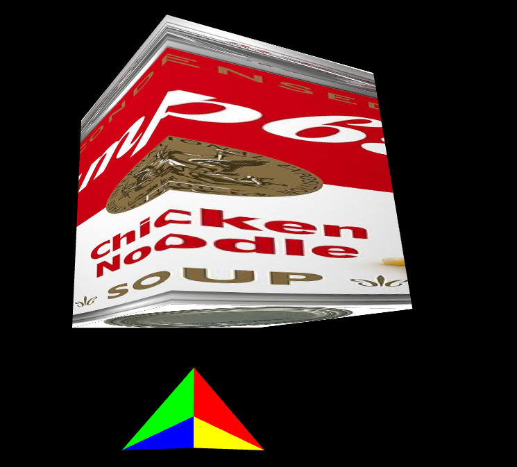

# Space-Game-Rewritten

This is a rewrite of [space-game](https://github.com/dylanjtholen/space-game), except less shit. 

soup cube

<video src="https://raw.githubusercontent.com/dylanjtholen/space-game-2/refs/heads/main/vid_demo.mp4"></video>

Currently it has very little, just a basic 3d renderer using webgl and a few models. It's very laggy right now, but I plan to fix that in the coming weeks.

If you want to try it out, just serve index.html

planned features:

-   multiplayer
-   shooting and stuff
-   maybe a race mode/time trial thing

  
if u couldnt tell i suck at using markdown
